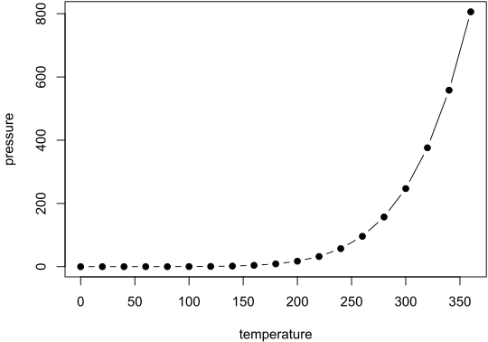

# Images {#images}
This section is for basic images / graphics.

## Basic PNG
```{r, echo=FALSE}
knitr::include_graphics("images/testimage4.png")
```

## Simple PNG File (Centered, 50%)
This is a simple centered PNG file

```{r, fig.align = 'center', fig.cap="Centered PNG at 50%", out.width="50%", echo=FALSE}
knitr::include_graphics("images/testimage3.png")
```

## Simple PNG File (Right-Aligned, 30%)
This is a simple right-aligned PNG file. SVG files don't seem to work with PDF output..

```{r, fig.align = 'right', fig.cap="Right-Aligned SVG at 30%", out.width="30%", echo=FALSE}

```

## Show two images horizonally
You can combine multiple images into a single figure.

```{r, echo=FALSE,out.width="49%", out.height="20%", fig.cap="caption", fig.show='hold',fig.align='center'}
knitr::include_graphics(c("images/testimage3.png", "images/testimage1.png"))
```

